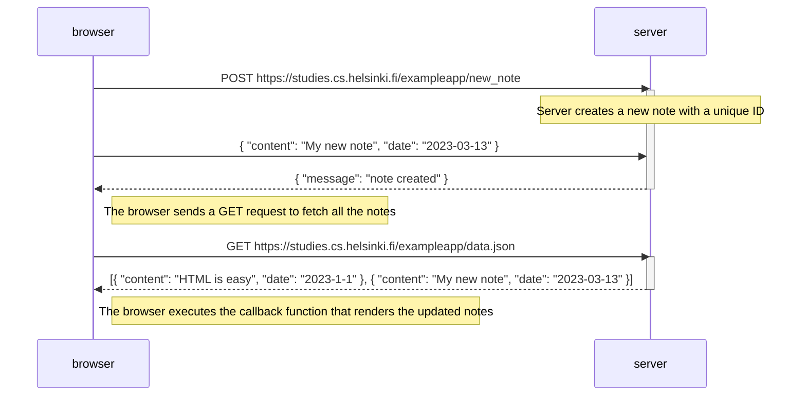

```mermaid
  sequenceDiagram
      participant browser
      participant server

      browser->>server: POST https://studies.cs.helsinki.fi/exampleapp/new_note
      activate server
      Note over server: Server creates a new note with a unique ID
      browser->>server: { "content": "My new note", "date": "2023-03-13" }
      server-->>browser: { "message": "note created" }
      deactivate server

      Note right of browser: The browser sends a GET request to fetch all the notes
      browser->>server: GET https://studies.cs.helsinki.fi/exampleapp/data.json
      activate server
      server-->>browser: [{ "content": "HTML is easy", "date": "2023-1-1" }, { "content": "My new note", "date": "2023-03-13" }]
      deactivate server

      Note right of browser: The browser executes the callback function that renders the updated notes
   
```
