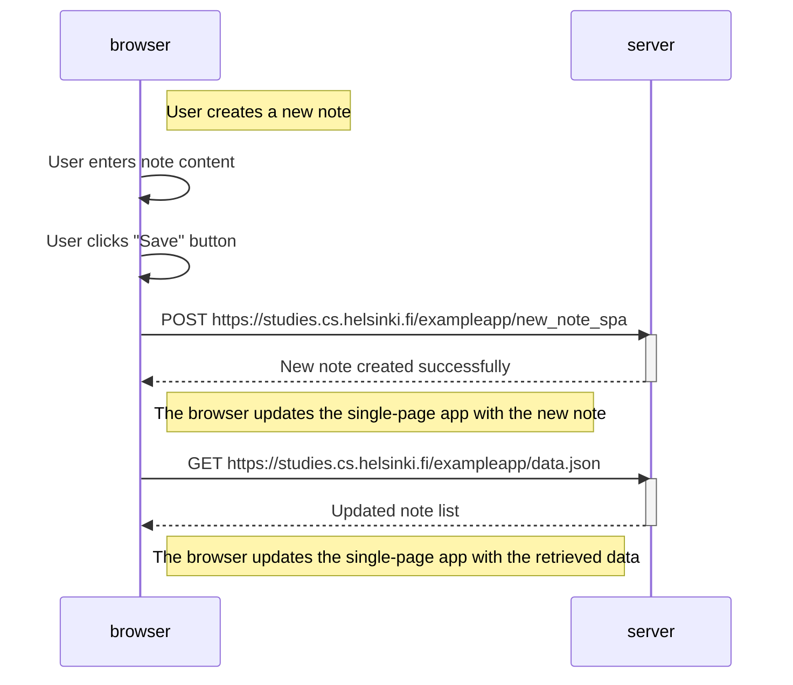

```mermaid
sequenceDiagram
    participant browser
    participant server

    Note right of browser: User creates a new note
    browser->>browser: User enters note content
    browser->>browser: User clicks "Save" button

    browser->>server: POST https://studies.cs.helsinki.fi/exampleapp/new_note_spa
    activate server
    server-->>browser: New note created successfully
    deactivate server

    Note right of browser: The browser updates the single-page app with the new note

    browser->>server: GET https://studies.cs.helsinki.fi/exampleapp/data.json
    activate server
    server-->>browser: Updated note list
    deactivate server

    Note right of browser: The browser updates the single-page app with the retrieved data
```